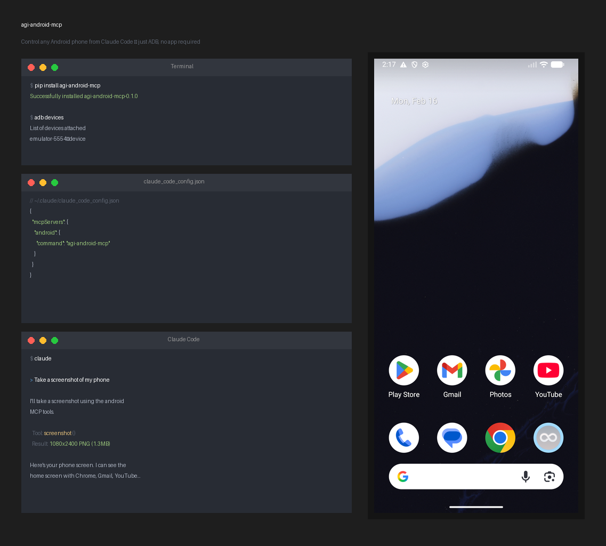

# agi-android-mcp

Control any Android phone from Claude Code, Cursor, or any MCP client — just ADB, no app required.



## How it works

```
Claude Code  ──(MCP stdio)──►  agi-android-mcp  ──(ADB)──►  Android Phone
```

A lightweight Python MCP server that translates tool calls into `adb` commands. Works with any Android phone that has USB debugging enabled. No proprietary dependencies.

## Quick Start

### 1. Install

```bash
pip install agi-android-mcp
```

### 2. Plug in your phone

Enable USB debugging (Settings > Developer options > USB debugging), connect via USB, and verify:

```bash
adb devices
# emulator-5554    device
```

### 3. Add to Claude Code

```bash
claude mcp add android -- agi-android-mcp
```

Restart Claude Code. That's it. Tell Claude:

> "Take a screenshot of my phone"

> "Open Chrome and search for the weather"

> "Launch Settings and turn on dark mode"

Claude will take screenshots, reason about the UI, and tap/type/swipe to accomplish the task.

### Add to Cursor

Add to `.cursor/mcp.json`:

```json
{
  "mcpServers": {
    "android": {
      "command": "agi-android-mcp"
    }
  }
}
```

### Any MCP client

The server uses stdio transport. Run `agi-android-mcp` as the command — it speaks MCP over stdin/stdout.

## Tools (18)

| Tool | Description |
|------|-------------|
| `screenshot` | Take a screenshot, returned as PNG image |
| `get_screen_size` | Get screen dimensions in pixels |
| `tap(x, y)` | Tap at pixel coordinates |
| `double_tap(x, y)` | Double-tap at pixel coordinates |
| `long_press(x, y)` | Long-press at pixel coordinates |
| `type_text(text)` | Type text into focused input field |
| `press_key(key)` | Press a key (enter, backspace, tab, space, home, back) |
| `swipe(direction)` | Swipe up/down/left/right from screen center |
| `drag(start, end)` | Drag between two points |
| `press_home()` | Press the Home button |
| `press_back()` | Press the Back button |
| `open_notifications()` | Open the notification shade |
| `open_quick_settings()` | Open quick settings panel |
| `launch_app(package)` | Launch an app by package name |
| `get_current_app()` | Get the currently visible app/activity |
| `list_installed_apps()` | List installed packages |
| `shell(command)` | Run any ADB shell command |
| `get_device_info()` | Get device model, Android version, screen size, battery |

## Environment Variables

| Variable | Default | Description |
|----------|---------|-------------|
| `ADB_PATH` | Auto-detected | Path to `adb` binary |
| `ADB_SERIAL` | (none) | Target a specific device by serial number |

Multiple devices? Set `ADB_SERIAL`:

```json
{
  "mcpServers": {
    "android": {
      "command": "agi-android-mcp",
      "env": {
        "ADB_SERIAL": "XXXXXXXXXXXXXX"
      }
    }
  }
}
```

## Agentic Demo

`demo.py` runs a full autonomous loop: screenshot → Claude reasons → execute action → repeat.

```bash
pip install anthropic
ANTHROPIC_API_KEY=sk-... python demo.py "Open Chrome and search for cats"
```

## How It Works

1. MCP server starts over stdio (standard MCP transport)
2. When a tool is called, it translates to an `adb` subprocess call
3. Screenshots: `adb exec-out screencap -p`
4. Input: `adb shell input tap/swipe/text/keyevent`
5. Apps: `adb shell am`, `adb shell pm`

## Development

```bash
pip install -e .
python -c "from agi_android_mcp.server import mcp; print(len(mcp._tool_manager._tools), 'tools')"
```

## License

MIT
